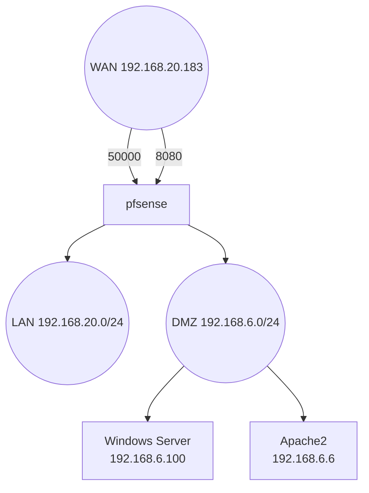

# TP PfSense – DMZ & Addon  
**Auteur : Charles BRIENNE**  
**BTS SIO – SISR**  
**Date : 11/10/2026**

---

# 🧪 Mise en situation 1 — Monitoring du LAN

## 🎯 Objectif
Le DSI souhaite monitorer le trafic du réseau LAN via une interface web accessible depuis le navigateur.

## 🟦 Choix de la solution : Darkstat
Darkstat permet :
- la capture du trafic réseau,
- l’analyse des flux par IP,
- une interface web simple et intégrée.

## 🟩 Installation
1. pfSense → System → Package Manager → Available Packages  
2. Installation de `darkstat`  
3. Activation via Services → Darkstat

## 🟧 Validation
Accès à l’interface web :  
`http://192.168.20.1:666`

### 📸 Interface Darkstat
  
Affichage du trafic LAN en temps réel via Darkstat.

---

# 🧪 Mise en situation 2 — Serveur Windows dans la DMZ accessible en RDP

## 🎯 Objectif
Permettre l’accès RDP depuis Internet vers un serveur Windows placé dans la DMZ.

---

# 🟦 Configuration DMZ
- Réseau DMZ : `192.168.6.0/24`  
- pfSense DMZ : `192.168.6.1`  
- Windows Server DMZ : `192.168.6.100`  
- RDP activé sur le serveur

---

# 🟩 NAT WAN → DMZ (RDP)

## 🔧 Règle NAT
| Paramètre | Valeur |
|----------|--------|
| Interface | WAN |
| Protocole | TCP |
| Port WAN | `50000` |
| Redirect IP | `192.168.6.100` |
| Redirect port | `3389` |
| Description | NAT RDP DMZ |

### 📸 NAT RDP DMZ
  
Règle NAT permettant l’accès RDP depuis Internet.

---

## 🔧 Règle Firewall WAN (auto‑générée)

### 📸 Règle Firewall WAN – RDP
  
Règle autorisant le flux RDP sur le port WAN 50000.

---

## 🟧 Validation externe
Test depuis un réseau externe (4G) :

```
mstsc → 192.168.20.183:50000
```

### 📸 Test RDP externe
  
Connexion réussie au serveur Windows DMZ via RDP.

---

# 🌐 Mise en situation 3 — Accès Apache2 dans la DMZ depuis Internet

## 🎯 Objectif
Accéder à une VM Apache2 située dans la DMZ depuis Internet via un port WAN dédié.

---

# 🟦 Informations VM Apache
- IP Apache DMZ : `192.168.6.6`  
- Service : Apache2 (port 80)

---

# 🟩 NAT WAN → DMZ (Apache)

## 🔧 Règle NAT
| Paramètre | Valeur |
|----------|--------|
| Interface | WAN |
| Protocole | TCP |
| Port WAN | `8080` |
| Redirect IP | `192.168.6.6` |
| Redirect port | `80` |
| Description | NAT Apache DMZ |

### 📸 NAT Apache DMZ
  
Règle NAT permettant l’accès HTTP depuis Internet.

---

## 🔧 Règle Firewall WAN (auto‑générée)

### 📸 Règle Firewall WAN – Apache
  
Règle autorisant le flux HTTP sur le port WAN 8080.

---

## 🟧 Validation externe
Test depuis un réseau externe :

```
`http://192.168.20.183:8080` 
```

### 📸 Test Apache externe
  
Affichage de la page Apache2 via le NAT WAN → DMZ.

---

# 🖥️ ipconfig du Windows Server DMZ

### 📸 ipconfig Windows Server DMZ
  
Le serveur Windows est bien dans la DMZ : 192.168.6.100.

---

# 🗺️ Topologie réseau

### 📸 Topologie Proxmox
  
Vue des VM : pfSense, Windows Server DMZ, Apache DMZ.

### 🗺️ Schéma réseau (Mermaid)


